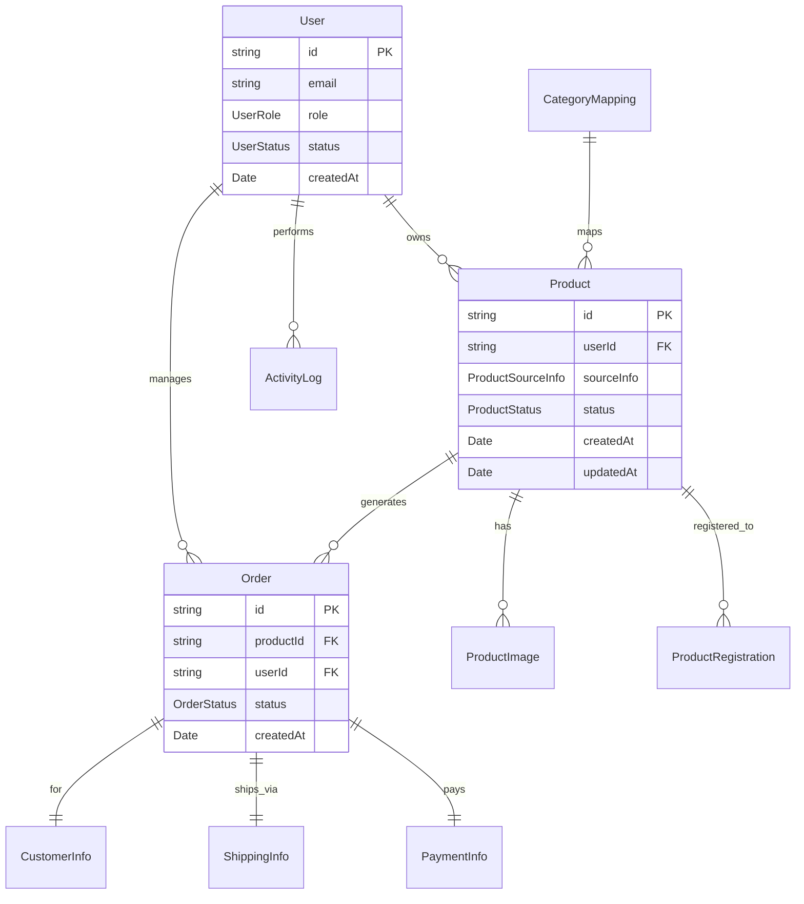
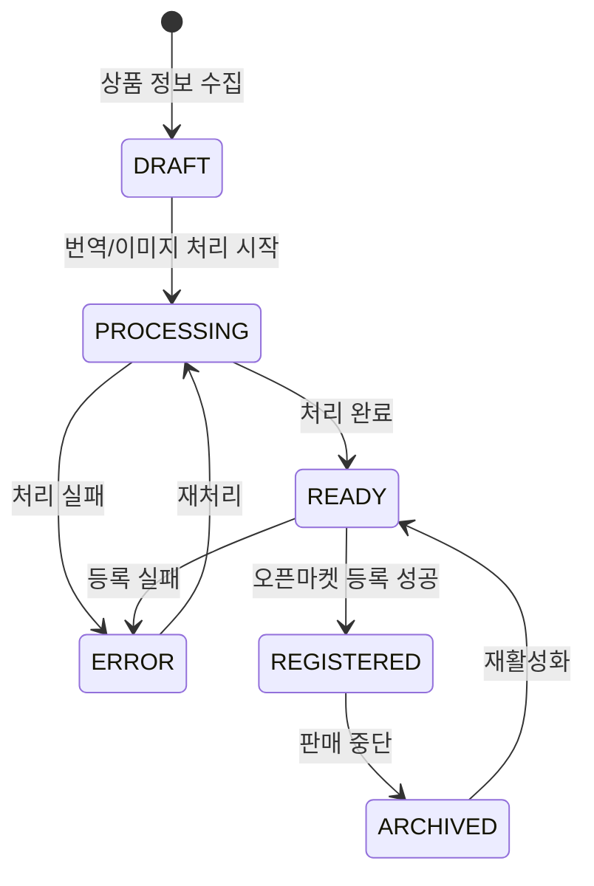
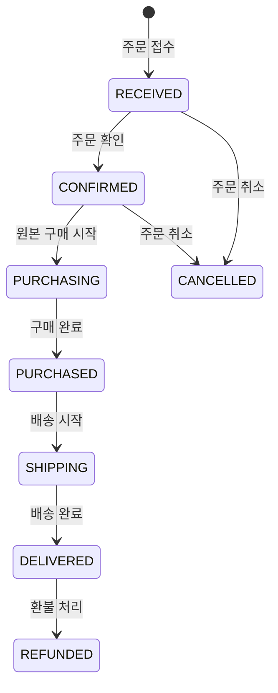

# 데이터 모델 설계: 글로벌 쇼핑몰 상품 아웃소싱 시스템

## 1. 핵심 엔티티 (Core Entities)

### 1.1 사용자 (User)
```typescript
interface User {
  id: string;              // UUID
  email: string;           // 로그인 이메일
  name: string;           // 사용자명
  role: UserRole;         // ADMIN | SELLER | VIEWER
  status: UserStatus;     // ACTIVE | INACTIVE | SUSPENDED

  // 프로필 정보
  profile: UserProfile;

  // 설정
  preferences: UserPreferences;

  // 타임스탬프
  createdAt: Date;
  updatedAt: Date;
  lastLoginAt?: Date;
}

interface UserProfile {
  phone?: string;
  company?: string;
  businessNumber?: string;  // 사업자등록번호
  address?: Address;
}

interface UserPreferences {
  defaultMarginRate: number;     // 기본 마진율 (%)
  preferredOpenMarkets: string[];  // 선호 오픈마켓
  notificationSettings: NotificationSettings;
  language: 'ko' | 'en' | 'zh';
}

enum UserRole {
  ADMIN = 'ADMIN',
  SELLER = 'SELLER',
  VIEWER = 'VIEWER'
}

enum UserStatus {
  ACTIVE = 'ACTIVE',
  INACTIVE = 'INACTIVE',
  SUSPENDED = 'SUSPENDED'
}
```

### 1.2 상품 (Product)
```typescript
interface Product {
  id: string;              // UUID
  userId: string;          // 소유자

  // 원본 정보
  sourceInfo: ProductSourceInfo;

  // 수집된 정보
  originalData: ProductOriginalData;

  // 번역된 정보
  translatedData: ProductTranslatedData;

  // 판매 설정
  salesSettings: ProductSalesSettings;

  // 등록 상태
  registrations: ProductRegistration[];

  // 모니터링 정보
  monitoring: ProductMonitoring;

  // 통계
  statistics: ProductStatistics;

  // 상태
  status: ProductStatus;

  // 타임스탬프
  createdAt: Date;
  updatedAt: Date;
}

interface ProductSourceInfo {
  sourceUrl: string;        // 원본 상품 URL
  sourcePlatform: SourcePlatform;  // 'TAOBAO' | 'AMAZON' | 'ALIBABA'
  sourceProductId: string;  // 원본 플랫폼 상품 ID
  lastCrawledAt: Date;
}

interface ProductOriginalData {
  title: string;           // 원본 상품명
  description: string;     // 원본 설명
  price: ProductPrice;     // 원본 가격 정보
  images: ProductImage[];  // 원본 이미지
  specifications: Record<string, any>; // 상품 스펙
  category: string;        // 원본 카테고리
  brand?: string;          // 브랜드
  model?: string;          // 모델명
  tags: string[];          // 태그
}

interface ProductTranslatedData {
  title: string;           // 번역된 상품명
  description: string;     // 번역된 설명
  specifications: Record<string, any>; // 번역된 스펙
  translatedAt: Date;
  translationEngine: string; // 'GOOGLE' | 'PAPAGO' | 'BAIDU'
  qualityScore: number;    // 번역 품질 점수 (0-100)
}

interface ProductSalesSettings {
  marginRate: number;      // 마진율 (%)
  salePrice: number;       // 판매가격 (원)
  minPrice?: number;       // 최소가격
  maxPrice?: number;       // 최대가격
  targetMarkets: string[]; // 등록할 오픈마켓 목록
  autoUpdate: boolean;     // 자동 업데이트 여부
}

interface ProductRegistration {
  id: string;
  platform: OpenMarketPlatform;
  platformProductId?: string; // 플랫폼별 상품 ID
  status: RegistrationStatus;
  categoryMapping: string;    // 플랫폼별 카테고리
  registeredAt?: Date;
  lastUpdatedAt?: Date;
  errors?: RegistrationError[];
}

interface ProductMonitoring {
  isActive: boolean;
  lastCheckedAt?: Date;
  priceHistory: PriceHistory[];
  stockStatus: StockStatus;
  alerts: ProductAlert[];
}

enum ProductStatus {
  DRAFT = 'DRAFT',
  PROCESSING = 'PROCESSING',
  READY = 'READY',
  REGISTERED = 'REGISTERED',
  ERROR = 'ERROR',
  ARCHIVED = 'ARCHIVED'
}

enum SourcePlatform {
  TAOBAO = 'TAOBAO',
  AMAZON = 'AMAZON',
  ALIBABA = 'ALIBABA'
}

enum OpenMarketPlatform {
  ELEVENST = 'ELEVENST',      // 11번가
  GMARKET = 'GMARKET',        // 지마켓
  AUCTION = 'AUCTION',        // 옥션
  COUPANG = 'COUPANG',        // 쿠팡
  NAVER = 'NAVER'             // 네이버쇼핑
}

enum RegistrationStatus {
  PENDING = 'PENDING',
  PROCESSING = 'PROCESSING',
  SUCCESS = 'SUCCESS',
  FAILED = 'FAILED',
  UPDATING = 'UPDATING'
}
```

### 1.3 주문 (Order)
```typescript
interface Order {
  id: string;              // UUID
  productId: string;       // 상품 ID
  userId: string;          // 판매자 ID

  // 오픈마켓 주문 정보
  marketOrder: MarketOrderInfo;

  // 원본 구매 정보
  sourcePurchase?: SourcePurchaseInfo;

  // 고객 정보
  customer: CustomerInfo;

  // 배송 정보
  shipping: ShippingInfo;

  // 금액 정보
  payment: PaymentInfo;

  // 상태
  status: OrderStatus;

  // 타임스탬프
  createdAt: Date;
  updatedAt: Date;
  completedAt?: Date;
}

interface MarketOrderInfo {
  platform: OpenMarketPlatform;
  orderId: string;         // 오픈마켓 주문번호
  orderDate: Date;
  quantity: number;
  unitPrice: number;
  totalPrice: number;
}

interface SourcePurchaseInfo {
  purchaseId?: string;     // 원본 플랫폼 구매번호
  purchaseDate?: Date;
  purchasePrice: number;
  purchaseStatus: PurchaseStatus;
  trackingNumber?: string;
}

interface CustomerInfo {
  name: string;
  phone: string;
  email?: string;
  address: Address;
  memo?: string;
}

interface ShippingInfo {
  carrier?: string;        // 배송업체
  trackingNumber?: string; // 배송 추적번호
  shippedAt?: Date;        // 출고일
  deliveredAt?: Date;      // 배송 완료일
  status: ShippingStatus;
}

interface PaymentInfo {
  saleAmount: number;      // 매출액
  costAmount: number;      // 원가
  shippingFee: number;     // 배송비
  commission: number;      // 수수료
  netProfit: number;       // 순이익
  profitRate: number;      // 수익률 (%)
}

enum OrderStatus {
  RECEIVED = 'RECEIVED',     // 주문접수
  CONFIRMED = 'CONFIRMED',   // 주문확인
  PURCHASING = 'PURCHASING', // 원본 구매중
  PURCHASED = 'PURCHASED',   // 원본 구매완료
  SHIPPING = 'SHIPPING',     // 배송중
  DELIVERED = 'DELIVERED',   // 배송완료
  CANCELLED = 'CANCELLED',   // 취소
  REFUNDED = 'REFUNDED'      // 환불
}

enum PurchaseStatus {
  PENDING = 'PENDING',
  PROCESSING = 'PROCESSING',
  SUCCESS = 'SUCCESS',
  FAILED = 'FAILED'
}

enum ShippingStatus {
  PREPARING = 'PREPARING',
  SHIPPED = 'SHIPPED',
  IN_TRANSIT = 'IN_TRANSIT',
  DELIVERED = 'DELIVERED',
  FAILED = 'FAILED'
}
```

### 1.4 카테고리 매핑 (CategoryMapping)
```typescript
interface CategoryMapping {
  id: string;
  sourceCategory: string;    // 원본 카테고리
  sourcePlatform: SourcePlatform;

  // 플랫폼별 매핑
  mappings: PlatformCategoryMapping[];

  // 메타데이터
  confidence: number;       // 매핑 신뢰도 (0-100)
  isVerified: boolean;      // 수동 검증 여부
  createdBy: string;        // 생성자

  createdAt: Date;
  updatedAt: Date;
}

interface PlatformCategoryMapping {
  platform: OpenMarketPlatform;
  categoryCode: string;     // 플랫폼별 카테고리 코드
  categoryName: string;     // 플랫폼별 카테고리명
  path: string[];           // 카테고리 경로
}
```

## 2. 지원 엔티티 (Supporting Entities)

### 2.1 이미지 (Image)
```typescript
interface ProductImage {
  id: string;
  productId: string;

  // 원본 이미지
  originalUrl: string;

  // 처리된 이미지
  processedImages: ProcessedImageVariant[];

  // 메타데이터
  metadata: ImageMetadata;

  // 상태
  status: ImageStatus;

  createdAt: Date;
  updatedAt: Date;
}

interface ProcessedImageVariant {
  size: 'thumbnail' | 'medium' | 'large' | 'original';
  url: string;             // CDN URL
  width: number;
  height: number;
  fileSize: number;        // bytes
  format: 'webp' | 'jpg' | 'png';
}

interface ImageMetadata {
  originalFileName?: string;
  mimeType: string;
  fileSize: number;
  dimensions: {
    width: number;
    height: number;
  };
  dominantColors: string[]; // hex colors
  hasWatermark: boolean;
}

enum ImageStatus {
  PENDING = 'PENDING',
  PROCESSING = 'PROCESSING',
  PROCESSED = 'PROCESSED',
  FAILED = 'FAILED'
}
```

### 2.2 작업 로그 (ActivityLog)
```typescript
interface ActivityLog {
  id: string;
  userId: string;
  entityType: 'PRODUCT' | 'ORDER' | 'USER';
  entityId: string;
  action: string;          // 'CREATE', 'UPDATE', 'DELETE', 'REGISTER' 등
  description: string;
  metadata?: Record<string, any>;
  ipAddress?: string;
  userAgent?: string;
  createdAt: Date;
}
```

### 2.3 시스템 설정 (SystemConfig)
```typescript
interface SystemConfig {
  key: string;             // 설정 키
  value: any;              // 설정 값
  type: 'string' | 'number' | 'boolean' | 'json';
  description: string;     // 설명
  category: string;        // 카테고리
  isPublic: boolean;       // 공개 설정 여부
  updatedBy: string;       // 수정자
  updatedAt: Date;
}

// 예시 설정들
interface SystemConfigs {
  'crawling.delay.taobao': number;        // 타오바오 크롤링 딜레이 (ms)
  'translation.default.engine': string;   // 기본 번역 엔진
  'image.max.size': number;               // 최대 이미지 크기 (MB)
  'margin.default.rate': number;          // 기본 마진율 (%)
  'currency.exchange.rate.usd': number;   // USD 환율
  'currency.exchange.rate.cny': number;   // CNY 환율
}
```

## 3. 데이터 관계 (Entity Relationships)



## 4. 데이터 검증 규칙 (Validation Rules)

### 4.1 사용자 검증
```typescript
const UserValidation = {
  email: z.string().email(),
  name: z.string().min(2).max(50),
  phone: z.string().regex(/^[0-9]{10,11}$/),
  businessNumber: z.string().regex(/^[0-9]{10}$/).optional(),
};
```

### 4.2 상품 검증
```typescript
const ProductValidation = {
  sourceUrl: z.string().url(),
  marginRate: z.number().min(0).max(1000), // 0% ~ 1000%
  salePrice: z.number().min(100),           // 최소 100원
  title: z.string().min(5).max(200),
  description: z.string().max(5000),
};
```

### 4.3 주문 검증
```typescript
const OrderValidation = {
  quantity: z.number().int().min(1).max(999),
  unitPrice: z.number().min(0),
  customerName: z.string().min(2).max(50),
  customerPhone: z.string().regex(/^[0-9]{10,11}$/),
};
```

## 5. 인덱스 전략 (Database Indexes)

### 5.1 성능 최적화 인덱스
```sql
-- 사용자 조회 최적화
CREATE INDEX idx_user_email ON users(email);
CREATE INDEX idx_user_status ON users(status);

-- 상품 검색 최적화
CREATE INDEX idx_product_user_id ON products(user_id);
CREATE INDEX idx_product_status ON products(status);
CREATE INDEX idx_product_source_platform ON products(source_info->>'sourcePlatform');
CREATE INDEX idx_product_created_at ON products(created_at DESC);

-- 주문 조회 최적화
CREATE INDEX idx_order_user_id ON orders(user_id);
CREATE INDEX idx_order_product_id ON orders(product_id);
CREATE INDEX idx_order_status ON orders(status);
CREATE INDEX idx_order_created_at ON orders(created_at DESC);

-- 복합 인덱스
CREATE INDEX idx_product_user_status ON products(user_id, status);
CREATE INDEX idx_order_user_status ON orders(user_id, status);
```

### 5.2 전문 검색 인덱스
```sql
-- 상품명 검색
CREATE INDEX idx_product_title_fulltext ON products
USING gin(to_tsvector('korean', original_data->>'title'));

-- 번역된 상품명 검색
CREATE INDEX idx_product_translated_title_fulltext ON products
USING gin(to_tsvector('korean', translated_data->>'title'));
```

## 6. 상태 전이 (State Transitions)

### 6.1 상품 상태 전이


### 6.2 주문 상태 전이


## 7. 데이터 보관 정책 (Data Retention)

### 7.1 보관 기간
```typescript
const DataRetentionPolicy = {
  activityLogs: '2년',        // 활동 로그
  productImages: '영구',      // 상품 이미지
  orderHistory: '5년',        // 주문 이력
  archivedProducts: '1년',    // 보관된 상품
  errorLogs: '6개월',         // 에러 로그
  crawlingData: '3개월',      // 크롤링 원본 데이터
};
```

### 7.2 데이터 정리 작업
```typescript
// 정기적 데이터 정리 (Cron Job)
interface DataCleanupJobs {
  dailyCleanup: {
    schedule: '0 2 * * *';    // 매일 오전 2시
    tasks: [
      'cleanup_expired_sessions',
      'cleanup_temporary_files',
      'archive_old_error_logs'
    ];
  };

  weeklyCleanup: {
    schedule: '0 3 * * 0';    // 매주 일요일 오전 3시
    tasks: [
      'cleanup_old_activity_logs',
      'optimize_database_indexes',
      'cleanup_unused_images'
    ];
  };
}
```

이 데이터 모델은 확장성과 유지보수성을 고려하여 설계되었으며, PostgreSQL의 JSON 컬럼을 활용하여 유연한 스키마를 제공합니다.